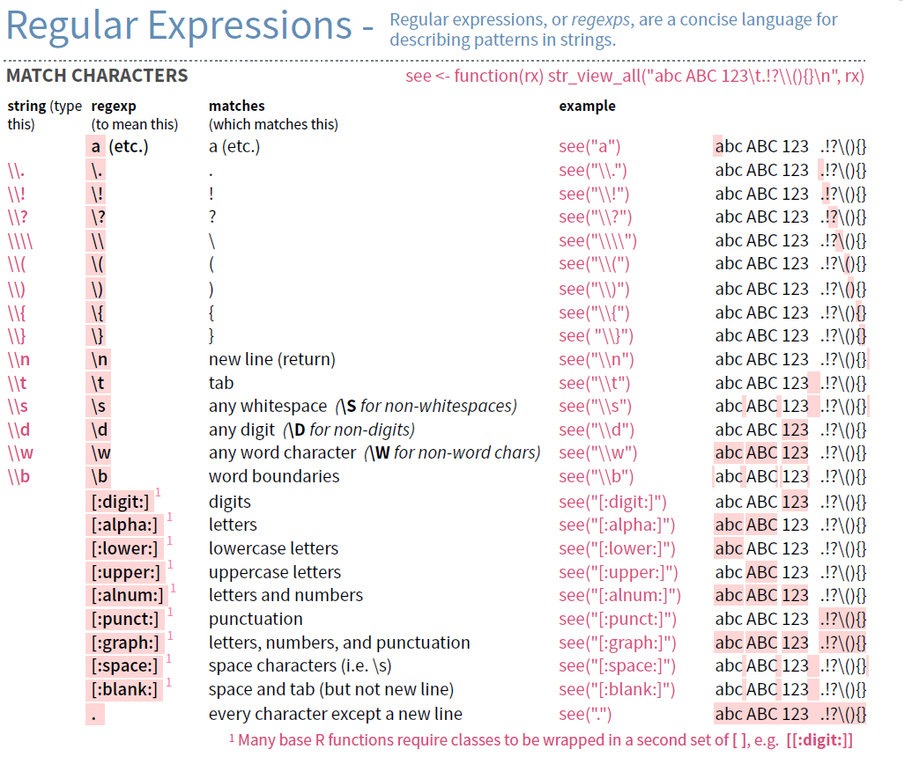

# REGEX


## Encoding

###### 1. Finding your default encoding settings:  
`Sys.getlocale()`: getting your PC settings.
+ `1252` refers to the default `Windows-1252` encoding.
+ On Mac, encoding standard is `UTF-8`


###### 2. Translating a string from on encoding to another

Use `iconv()` to translate from one to another. This will give better results than using `Encoding()` because in the latter case you actually just force a wrong encoding system on a set of strings, rather than really translating.

```r
iconv(vector, from="windows-1252", to="UTF-8")
```


###### 3. Finding the Encoding

For webpages: usually in the `<meta>` Translating.  
Otherwise, use package `tau`:

+ `tau::is.locale(vector)`
+ `tau::is.ascii(vector)`
+ `tau::is.utf8(vector)`
+ `Encoding(vector)`


<br><hr>

## Regular expressions

#### Case sensitivity:  
Options:  
+ Either take lower and upper in your regex
+ Transfer the vector to lower case: `str_extract(tolower(vector), pattern= "_____")`
+ Add ignore case to the pattern: `str_extract(vector, pattern= regex("_____", ignore_case=TRUE))`


#### Generals:  
+ `.`: any character except newline
+ `|`: or character
+ `^`: stat of the string
+ `$`: end of the string


#### Sequences: (from the Rstudio cheat sheet)  




Extra notes:
+ `[:alpha:]` is safer to use than [a-zA-Z] as it takes special characters into account such as é, è, ä, ...

+ In R, you need to use `[[:digit:]]` or it would interpret it as a character class identical to `[digt:]`.

+ To negate a self-built character class, use `[^abc]`. To negate the built-in character classes: `[^[:digit:]]`

+ Alternative for word boundaries: `\\<` for start of a word and `\>` for end of a word.

+ If a larger set has to be escaped, use `fixed()`. For escaped sequences, you can use `writeLines()` to see how R views your string after all special characters have been parsed.


<br>

#### Quantifiers

+ `?`: optional, zero or one
+ `*`: zero or more
+ `+`: one or more
+ `{n}`: exactly n times
+ `{n,}`: n or more times
+ `{n,m}`: between n and m times

To quantify a single character: just add afterwards  
To quantify a group of characters: add between brackets ()

Note: R applies *greedy quantification* and tries to match the longest sequence possible. To revert and have the shortest sequence possible, add `?` after the quantifier. Example: `pattern="A.+?A"`


<br>

####  Back referencing

To match an earlier sequence use backreferencing.
+ Wrap the first pattern in brackets ()
+ Refer to that pattern later with `\\1`, `\\2` etc

```r
# a word, then anything else, the a repeat of that word
str_extract(vector, pattern="([[:alpha:]]+).+\\1")
```


<br><hr>

## Resources

+ [Rstudio string cheat sheet](https://www.rstudio.com/resources/cheatsheets/)

+ [Automated Data collection with R](http://www.r-datacollection.com/)
